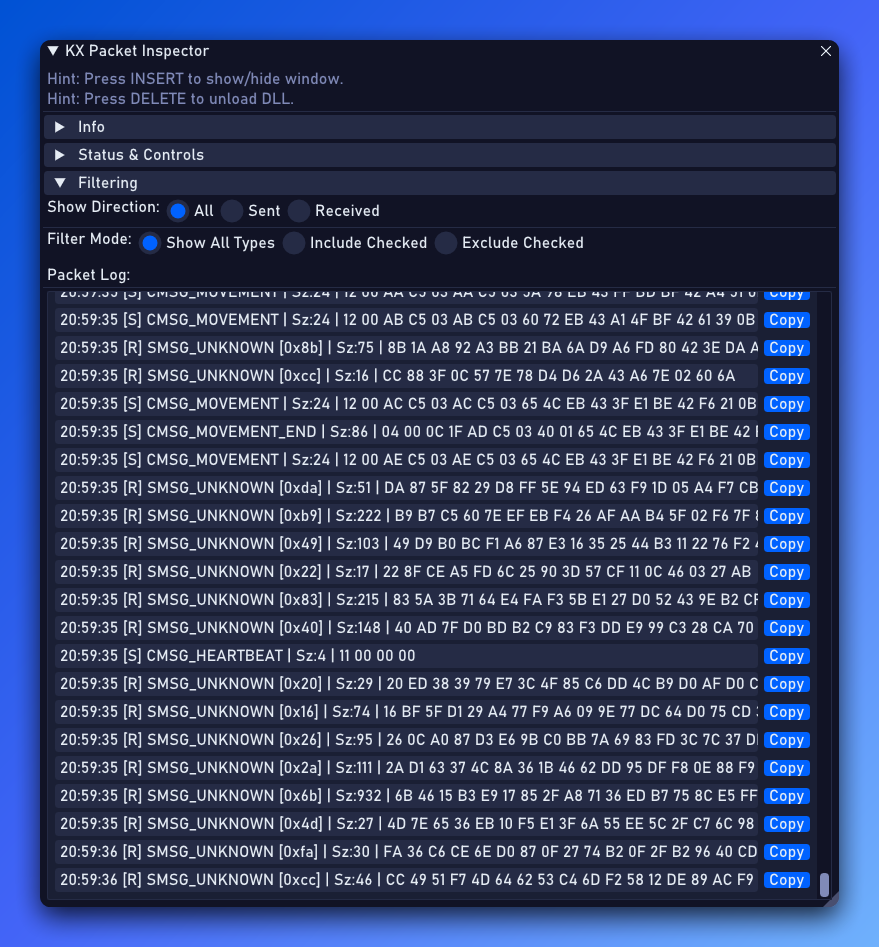

# KX Packet Inspector (Guild Wars 2)

**Disclaimer:** This tool is intended for educational purposes only, allowing users to explore and understand network communication in Guild Wars 2. Using this tool may violate the game's Terms of Service. Use it responsibly and at your own risk.

## Overview

KX Packet Inspector is a tool designed to intercept and display **both outgoing (sent) and incoming (received)** network packets used by the Guild Wars 2 client (`Gw2-64.exe`). It uses DirectX 11 hooking and function detouring (via MinHook) to capture packet data. Outgoing packets are captured *before* final processing/encryption, while incoming packets are captured and potentially decrypted (if using RC4) before being fully processed by the client. Captured data is presented in a real-time ImGui window overlay.

The primary goal is to facilitate learning about the game's network protocol and potentially identify new or undocumented packet structures for both client-to-server (CMSG) and server-to-client (SMSG) communication.



## Features

*   **Real-time Bidirectional Packet Logging:** Captures and displays **sent (CMSG)** and **received (SMSG)** packet information (timestamp, direction, header ID, size, raw hex data).
*   **RC4 Decryption Attempt:** Attempts to decrypt incoming packets if the connection state indicates RC4 encryption and the state can be captured.
*   **Packet Identification:** Attempts to identify known CMSG and SMSG packet headers based on their first byte (after potential decryption for received packets). Handles unknown headers gracefully.
*   **ImGui Interface:** Provides a clean in-game overlay to view packets, filter them, and control capture.
*   **Flexible Filtering:**
    *   Filter by direction (Show All / Sent Only / Received Only).
    *   Filter by header/type (Show All / Include Checked / Exclude Checked).
    *   Checkboxes provided for known CMSG, known SMSG, and special types (Encrypted, Unknown, Empty).
*   **Clipboard Support:** Copy individual log lines to the clipboard.
*   **Controls:** Pause/resume capture, clear the log.
*   **Hotkeys:**
    *   `INSERT`: Show/Hide the Inspector window.
    *   `DELETE`: Unload the DLL and safely detach from the game.

## Status & Compatibility

This tool targets specific internal functions identified via pattern scanning. Packet *parsing* logic (in `GameStructs.h` and `PacketProcessor.cpp`) relies on structure offsets and behaviors derived from reverse engineering specific game versions.

*   **Potential Stability:** Core hooking (DirectX, function interception via patterns) may remain functional across some game patches.
*   **Potential Breakage:** Significant game updates that modify internal network code, encryption methods, or data structure layouts **may break** this tool. This could affect function patterns, structure offsets (`GameStructs.h`), buffer state interpretation, or decryption logic (`CryptoUtils.cpp`, `PacketProcessor.cpp`).
*   **Maintenance:** We will try to keep the tool updated if major breakages occur. However, community contributions for identifying issues and providing updated offsets, patterns, or logic are highly encouraged!

## Building

`kx-packet-inspector` is a C++ project designed to work on Windows using Visual Studio.

**Prerequisites:**

*   **Visual Studio:** Ensure that you have Visual Studio installed (2022 or later recommended), with the **Desktop development with C++** workload.
*   **Windows SDK:** Usually included with the Visual Studio workload.

**Build Instructions:**

1.  **Clone the Repository:**
    ```bash
    git clone https://github.com/Krixx1337/kx-packet-inspector.git
    cd kx-packet-inspector
    ```
2.  **Open the Project in Visual Studio:** Open `KXPacketInspector.sln`.
3.  **Build:** Select configuration (e.g., `Release` | `x64`) and build (`Build` > `Build Solution` or `Ctrl+Shift+B`).
4.  **Output:** The compiled DLL (`KXPacketInspector.dll`) will be in the output directory (e.g., `x64/Release`).

## Usage

You can either **download a pre-compiled `.dll`** from the project's [Releases page](https://github.com/Krixx1337/kx-packet-inspector/releases) or **build it yourself**.

1.  Obtain the `KXPacketInspector.dll` file.
2.  Use a DLL injector (e.g., Xenos, Process Hacker) to inject the DLL into the running `Gw2-64.exe` process, preferably *after* the game is fully loaded (character select or in-game).
3.  Press `INSERT` to toggle the inspector window visibility.
4.  Use the UI controls for filtering, pausing, clearing, and copying.
5.  Press `DELETE` to unload the tool cleanly.

## TODO & Community Contributions

This project is open source, and community involvement is highly welcome! Here are some areas where help would be great:

*   **[X] Log Received Packets:** *(Implemented)* - Tool now logs both sent and received packets.
*   **[ ] Identify More Packet Headers:** The `PacketHeaders.h` file contains only a small subset of known packets. Researching, identifying, and adding more headers (especially **SMSG**) with their correct IDs and names would greatly improve the tool's utility.
*   **[ ] Improve Packet Parsing:** Define structures for the *payload* of known packets (both CMSG and SMSG) to automatically parse and display their fields instead of just raw hex data. This is the core area for community contribution.
*   **[ ] Refine Decryption:** Investigate if other encryption/compression methods are used and implement support if possible. Improve robustness of RC4 state capture.
*   **[ ] Update Structure Offsets/Patterns:** If game updates break the tool, help reverse engineer the new function patterns or structure offsets.
*   **[ ] Bug Fixes & Enhancements:** Improve the UI, add new features (e.g., saving logs, search), fix bugs.

Feel free to fork the repository, make changes, and submit Pull Requests!

## Credits

*   Initial hooking/scanning concepts adapted from [rafzi's Hacklib_gw2](https://bitbucket.org/rafzi/hacklib_gw2/src/master/).
*   Uses [Dear ImGui](https://github.com/ocornut/imgui).
*   Uses [MinHook](https://github.com/TsudaKageyu/minhook).

## Community & Contact

Join our Discord server to discuss this tool, Guild Wars 2 development, or other projects:
[https://discord.gg/z92rnB4kHm](https://discord.gg/z92rnB4kHm)

Check out our other tools and projects at [kxtools.xyz](https://kxtools.xyz).

## License

This project is licensed under the [MIT License](LICENSE).