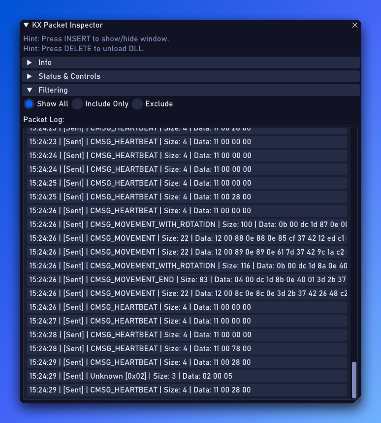

# KX Packet Inspector (Guild Wars 2)

**Disclaimer:** This tool is intended for educational purposes only, allowing users to explore and understand network communication in Guild Wars 2. Using this tool may violate the game's Terms of Service. Use it responsibly and at your own risk.

## Overview

KX Packet Inspector is a tool designed to intercept and display outgoing network packets sent by the Guild Wars 2 client (`Gw2-64.exe`). It uses DirectX 11 hooking and function detouring (via MinHook) to capture packet data *before* it undergoes final processing/encryption by the client, presenting it in a real-time ImGui window.

The primary goal is to facilitate learning about the game's network protocol and potentially identify new or undocumented packet structures.



## Features

*   **Real-time Packet Logging:** Captures and displays outgoing packet information (timestamp, header ID, size, raw hex data).
*   **Packet Identification:** Attempts to identify known packet headers based on their first byte.
*   **ImGui Interface:** Provides a clean in-game overlay to view packets, filter them, and control capture.
*   **Filtering:** Show all packets, include only selected types, or exclude selected types.
*   **Controls:** Pause/resume capture, clear the log.
*   **Hotkeys:**
    *   `INSERT`: Show/Hide the Inspector window.
    *   `DELETE`: Unload the DLL and safely detach from the game.

## Status & Compatibility

This tool was initially developed several months ago. While efforts were made to rely on pattern scanning for the core function hook, the packet *parsing* logic relies on structure offsets derived from reverse engineering specific game versions.

*   **Potential Stability:** Due to the nature of the packet sending function, the core hooking and basic structure might remain functional across several game patches, as observed historically.
*   **Potential Breakage:** Significant game updates that heavily modify internal network code or data structures **may break** this tool, particularly the packet parsing part (`GameStructs.h`).
*   **Maintenance:** We will try to keep the tool updated if major breakages occur. However, community contributions for identifying issues and providing updated offsets or patterns are highly encouraged!

## Building

`kx-packet-inspector` is a C++ project designed to work on Windows using Visual Studio.

**Prerequisites:**

*   **Visual Studio:** Ensure that you have Visual Studio installed (2022 or later recommended), with the **Desktop development with C++** workload.
*   **Windows SDK:** Usually included with the Visual Studio workload.

**Build Instructions:**

1.  **Clone the Repository:** Open your terminal or Git Bash, and clone the repository (replace `[your-repo-url]` with the actual URL):
    ```bash
    git clone https://github.com/Krixx1337/kx-packet-inspector.git
    cd kx-packet-inspector
    ```
2.  **Open the Project in Visual Studio:**
    *   Navigate to the cloned repository directory.
    *   Open the `KXPacketInspector.sln` file with Visual Studio.
3.  **Build:**
    *   Select the desired build configuration (e.g., `Release` and `x64` are recommended for release builds).
    *   Build the solution using the menu (`Build` > `Build Solution`) or the shortcut (`Ctrl+Shift+B`).
4.  **Output:** The compiled DLL (e.g., `KXPacketInspector.dll`) will be located in the output directory (e.g., `x64/Release`).

## Usage

You can either **download a pre-compiled `.dll`** from the project's [Releases page](https://github.com/Krixx1337/kx-packet-inspector/releases) or **build it yourself** using the instructions above.

1.  Obtain the `KXPacketInspector.dll` file.
2.  Use a DLL injector (such as Xenos, Process Hacker, etc.) to inject the DLL into the running `Gw2-64.exe` process. It's generally best to inject *after* the game has fully loaded (e.g., at character selection or in-game).
3.  Once injected, press `INSERT` to toggle the visibility of the packet inspector window.
4.  Use the controls within the window (filtering, pause, clear) as needed.
5.  When finished, press `DELETE` to unload the tool cleanly from the game process.

## TODO & Community Contributions

This project is open source, and community involvement is highly welcome! Here are some areas where help would be great:

*   **[ ] Log Received Packets:** Currently, only outgoing (sent) packets are hooked. Implementing hooks for incoming (received) packets would provide a more complete picture. This requires identifying and hooking the corresponding packet receiving function(s).
*   **[ ] Identify More Packet Headers:** The `PacketHeaders.h` file contains only a small subset of known packets. Researching, identifying, and adding more headers (both CMSG and SMSG) with their correct IDs and names would greatly improve the tool's utility.
*   **[ ] Improve Packet Parsing:** Define structures for the *payload* of known packets to automatically parse and display their fields instead of just raw hex.
*   **[ ] Update Structure Offsets:** If game updates break the current `GameStructs.h` definition, help reverse engineer the new offsets.
*   **[ ] Bug Fixes & Enhancements:** Improve the UI, add new features, fix bugs.

Feel free to fork the repository, make changes, and submit Pull Requests!

## Credits

*   Initial hooking code structure and pattern scanning concepts were adapted from [rafzi's Hacklib_gw2](https://bitbucket.org/rafzi/hacklib_gw2/src/master/).
*   Uses [Dear ImGui](https://github.com/ocornut/imgui) for the graphical user interface.
*   Uses [MinHook](https://github.com/TsudaKageyu/minhook) for function hooking.

## Community & Contact

Join our Discord server to discuss this tool, Guild Wars 2 development, or other projects:
[https://discord.gg/z92rnB4kHm](https://discord.gg/z92rnB4kHm)

Check out our other tools and projects at [kxtools.xyz](https://kxtools.xyz).

## License

This project is licensed under the [MIT License](LICENSE).
